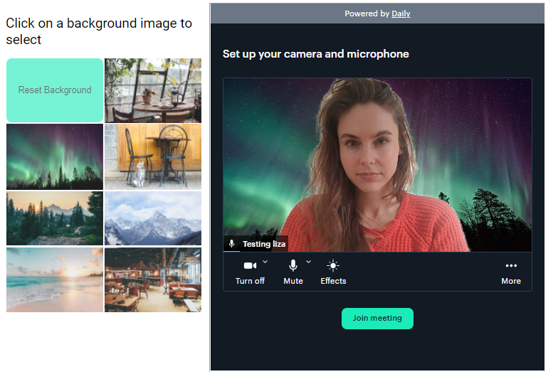

# Daily Prebuilt virtual backgrounds demo

This demo showcases usage of custom virtual backgrounds with [Daily Prebuilt](https://www.daily.co/blog/prebuilt-ui/).

## Prerequisites

- [Sign up for a Daily account](https://dashboard.daily.co/signup).

## How the demo works

This demo embeds the Daily Prebuilt iframe into a vanilla JavaScript application. It then loads a set of custom background images for the user to select from, allowing them to update their background in the video call.

## Running locally

1. Replace the room URL in `index.js` with the URL of your own room.
1. Install dependencies `npm i`
1. Run `npm start`

## Contributing and feedback

Let us know how experimenting with this demo goes! Feel free to reach out to us any time at `help@daily.co`.
